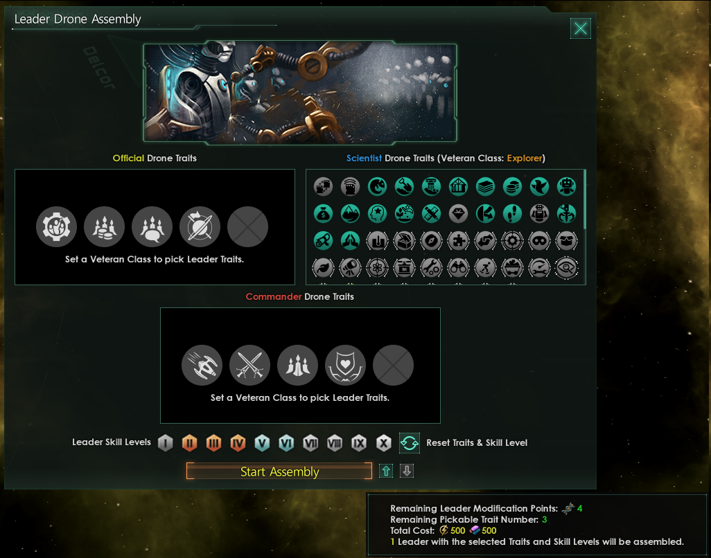
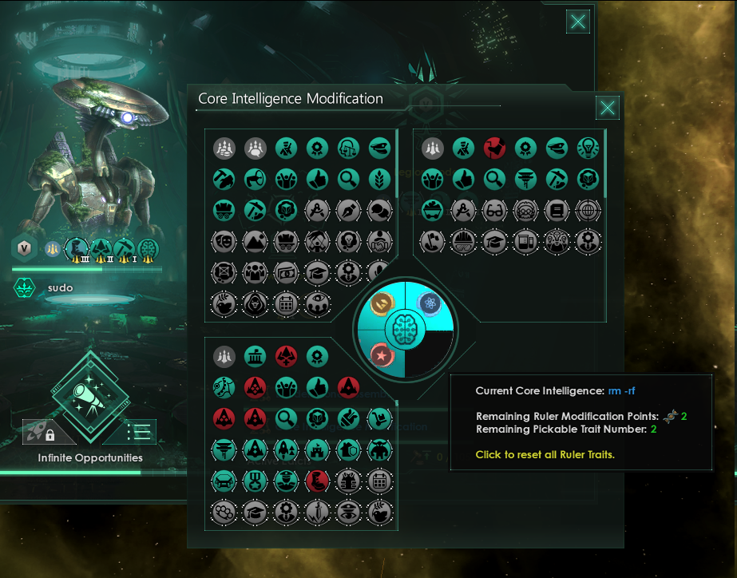
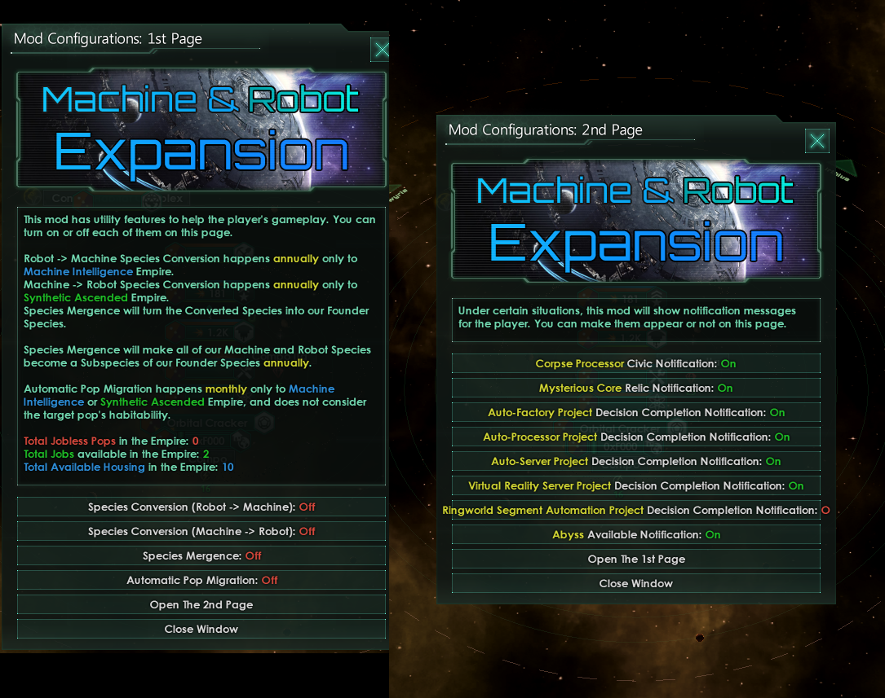

Core features
=============

This mod adds a variety of ascension perks, new playstyles, civics, traits, and much-needed love for Machines & Robots!

- Start as non-gestalt Robots (Mechanical Origin)
- Edit ruler traits, councilor traits, build leader with traits you pick
- Automated machine worlds that don't require pops to run, with 4 special planet types
- Switch from gestalt to non-gestalt Machines via AP, and back again
- Switch to/away from Driven Assimilator / Rogue Servitor / Determined Exterminator
- Machine Leaders revive after dying (backup trait)
- Ascend to a new bio-mechanical hybrid species
- Declare total war on the galaxy
- Psionic ascension; touch the Abyss ...
- Non-gestalt robots boost trade and empire-wide amenities with Virtual Reality servers planets
- Malware civic makes spy ops easier and adds new infiltration
- Boost your gestalt empire with Machine Learning civic
- Split open planets and mine them with Orbital Crackers

Added in Continuation:

- Release Machine vassals
- Automated Ringworlds
- Dismantle habitats (if your empire has any habitat tech)
- Extended Machines traits & Overclocked origin (thanks Legit Rikk)
- Reanimate defeated organic armies as a Machine empire
- Roleplay a fully automated pop-less Machine empire with the "World-Machines, Awakened" origin

And more!

- 15 Civics
- 15 Ascension Perks
- 6 Origins
- 80 Technologies
- 45 traits

Leader Assembly
---------------

Assemble machine leaders using a unique GUI interface. (Paragons DLC
required)

Once the required research is completed, a new edict becomes available
that triggers the GUI. Adding and removing traits costs resources, and
for balance, a trait “point” system is used, much like species
modification points.

*No longer limited to selecting drones that meet eligibility
requirements, our Machine empire fashions specialized leaders, taking
advantage of the modular nature of technology.*

Ruler Modification
------------------

Add or remove traits as desired with a GUI interface. (Paragons DLC
required)

Much like the leader builder, this GUI focuses on editing the empire’s
ruler. It also uses a traits points system.

*When our empire’s leader becomes outdated, it will be necessary to
retrofit bigger and better modules to govern and conquer.*

Councilor Editor (New in Continuation)
--------------------------------------

-  New tech following Core Modification and Leader Building
-  Custom GUI to edit each councilor, adding and removing traits

.. figure:: images/core-councilor-editor-sample.png
   :alt: Councilor Editor is available via edict. Trait additions and removals happen immediately.

Mod config menu
---------------

-  Toggle converting robots into primary Machine species (if playing as
   Machine)
-  Toggle converting machines into primary Robot species (if playing as
   Mechanical)

