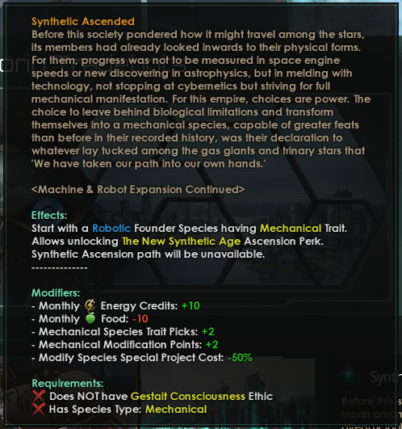
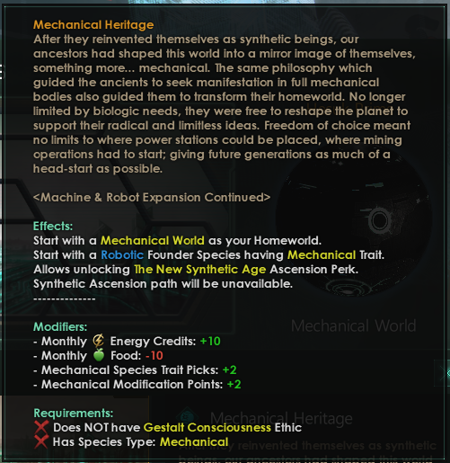
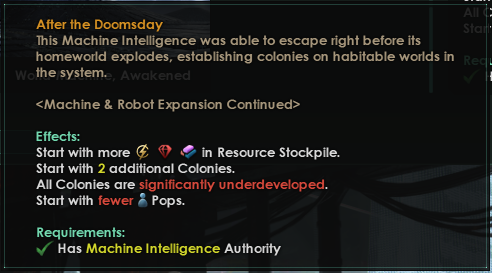
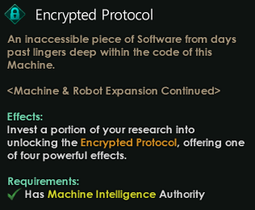

Origins
=======

Synthetic Ascended (Requires Utopia DLC)
----------------------------------------

_Members of this society have ascended as synthetic beings even before they knew how to travel amongst stars._

Effects:

- Start with a Robotic founder species having **Mechanical** trait.
- Monthly Energy: +10
- Monthly Food: -10

Requirements:

- Must not have Gestalt Consciousness ethic

Mechanical Heritage (Requires Utopia DLC)
-----------------------------------------

_After they ascended as synthetic beings, our ancestors had shaped this world into a mirror image of themselves, something more ... mechanical._

Effects:

- Start with a Robotic founder species having a **Mechanical** trait.
- Start with a Mechanical World as your homeworld.
- Monthly Energy: +10
- Monthly Food: -10

Requirements:

- Must not have Gestalt Consciousness ethic

After the Doomsday
------------------

- Colony is significantly underdeveloped
- Start with more resources
- Start with 2 additional colonies
- Start with fewer pops

Overclocked
-----------

The Machine equivalent of "Overturned", whichs opens up Overclocked traits for species, "which are stronger and cheaper than normal traits but carry extraordinary risks." There is a chance of pops and leaders "glitching", increased for every Overclocked trait in use.

_This is originally from `mute's Extended Machines mod`_, which was revamped and added to MRE:C by Legit-Rikk.

.. image:: images/origins/358869606-7ea623ef-d4d5-4261-bafd-970fe9844ea7.png

Encrypted Protocol
------------------

The Machine empire starts with a unique situation. There is source code in the species hardware that is a mystery. It must be decoded ..

_This is originally from `mute's Extended Machines mod`_, which was revamped and added to MRE:C by Legit-Rikk.

.. include:: wm_origin.rst

.. _mute's Extended Machines mod: https://steamcommunity.com/sharedfiles/filedetails/?id=2801950004