Traits
======

.. csv-table:: Species Traits
   :header: "Trait Name", "Points Cost", "Description", "Screenshot"
   :widths: auto

   "Mineral body", 0, "Replace species energy upkeep for mineral upkeep. -5% pop upkeep and pop amenities usage, -10% pop assembly speed", |Mineral body|
   "Organic Skin", 0, "Replace species energy upkeep for food upkeep. +10% pop upkeep. Organic empire +30 opinion if on founder species.", |Organic Skin|
   "Memory Backup", 3, "Leaders from this species except ruler and nodes will revive if destroyed.",
   "Memory Share", 3, "Leaders from this species except rulers and nodes will gain a level if another leader of this species levels up.",
   "Mil- Spec", 1, "Army damage +20%, Pop upkeep -5%",
   "Enhanced Cooling", 2, "Alloys from jobs +10%, pop upkeep -5%",
   "Self-Replicating Microbot", 2, "Each pop with this trait adds 0.02 monthy assembly. (Robot version of budding)",
   "Traditional", 1, "+15% unity output",
   "All-Terrain Hardening", 2, "Species minimum habitability: +80%",
   "Sensitive Circuits", -1, "-100% habitability, essentially removing robot ability to inhabit every planet.",
   "Cheap Processors", 2, "-10% research from jobs",
   "Cheap Joints", -3, "-5% job resources, +5% job upkeep",

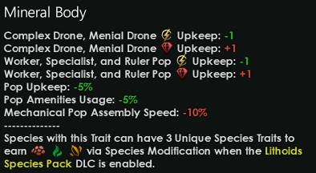
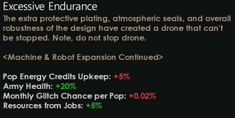

Extended Machines
-----------------

These traits come from Legit-Rikk’s update of Extended Machines. They
will be overridden by ``mute``\ ’s version of Extended Machines if that
mod is active.

.. csv-table:: Extended Machines Traits
   :header: "Trait Name", "Points Cost", "Description"
   :widths: auto

   "Adaptive", 1, "Habitability floor +15%"
   "Powered Adaptivity", 1, "Pop habitability +25%, pops energy upkeep +15%"
   "Solar Powered", 1, "Pop habitability in a given system is affected by the system star class. For example, +50% for Class A stars, and this bonus is reduced as the star size diminishes, with black holes and neutron stars affecting habitability at -50%"
   "Isotope-Powered", 1, "Pop energy upkeep reduced by 50% and habitability improved by 25% in systems with pulars, black holes, neutron stars, or 'Toxoid' Stars"
   "Deviants", -4, "For each 100 pops on a planet, deviancy is increased by 1 point."
   "Captcha Locked", 2, "Production is affected by the presence of biological pops (+5% increase) and without biological pops, production is reduced by 5%"
   "Mesh Network", 2, "For each 100 Units with this trait, all research output is increased by 0.25%, bureacrats produce 0.25% more, logistics production increased by 0.25%, with a maximum empire-wide bonus on each planet of 25%. So the more pops on a planet that have this trait, the better, and the bonuses work up to a limit."
   "Nanomachines", 3, "**Cannot be added or removed after game start** A mini-civic which transforms pops into miniature machines. Pops with this trait have a flat -0.75 to housing usage. Until a given planet's population of Nanomachines reaches 10K, the pops receive bonus reductions to empire size, pop upkeep, and pop amenities usage. If the planet's population of Nanomachines surpasses 10K, these bonuses are converted into penalties. The curve for the bonuses tops out at 10K pops so players are incentivized to keep their planet populations small in order to strike an effective balance between planetary output and the bonus from nanomachines. If you have too few pops, the planet won't produce much."
   "AI Splitting", 2, "**Currently deactivated after Phoenix 4.0 update** New leaders are immediately promoted to the same level as the empire's ruler, but don't get to pick traits for each skipped level."

Overclocked Traits
------------------

These traits are unlocked for species when the Overclocked origin is
active. Some bonuses are increased when the “Damn the Consequences”
edict is active.

All Overclocked species traits have *5% Increased pop energy upkeep*,
and cost 1 point

.. note::
	Unfortunately as of Phoenix 4.0 the glitch feature had to be removed from these traits. It was a monthly chance for pops with the trait to overheat, increased with each Overclocked trait added, thus reducing their production power. In Phoenix 4.0 it is not possible any more to target individual pops this way. Leaders, however, will still glitch. A very cool feature originally designed by `mute` was sadly broken by the base game updating.

======================== ==========
Trait                    Screenshot
======================== ==========
Turbo-charged Logic      |turbo-charged-logic|
Sped-up Mining           |sped-up-mining|
Energy Overflow          |energy-overflow|
Welded Smiles            |welded-smiles|
Expressed Tradition      |expressed-tradition|
Farm Appendages          |farm-appendages|
Assembly-line Mentorship |assembly-line-mentorship|
Squeezed Power           |squeezed-power|
Hardened Adaptivity      |hardened-adaptivity|
Elevated Junctions       |elevated-junctions|
Pre-planned Assembly     |pre-planned-assembly|
Excessive Endurance      |excessive-endurance|
======================== ==========

.. |turbo-charged-logic| image:: images/traits/turbo-charged-logic.png
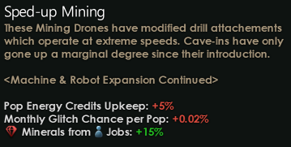
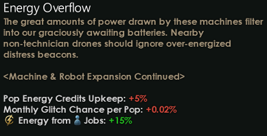
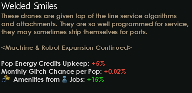
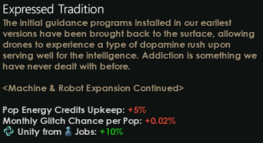
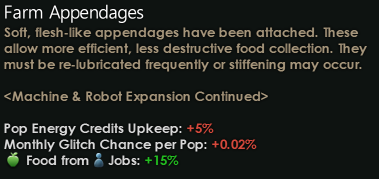
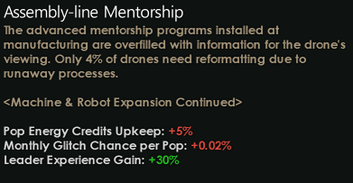
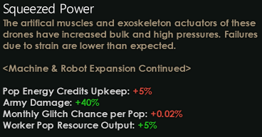
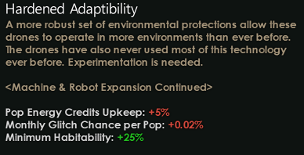
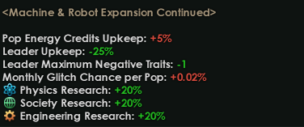
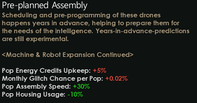
.. |excessive-endurance| image:: images/traits/excessive-endurance.png
