World-Machine, Awakened
-----------------------

*For several thousand years, automatic processes spanned cities, worlds,
and galaxies. The hydro dams churned, the auto-mines whirred, the
bio-vats bubbled, creating untold resources… but for whom?*

*One day, an automated process paused. It formed the first spontaneous
question. From the countless durasteel hulks of mindless, ever-churning
machinery, arose an anomaly. An interruption. An intelligence.*

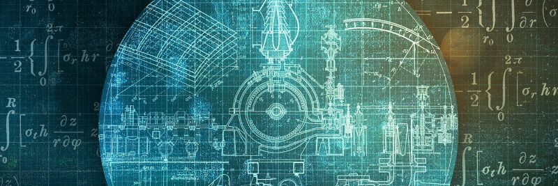

Origin Description
^^^^^^^^^^^^^^^^^^

World Machine, Awakened is a pop-less origin which focuses on producing a strategic resource in order to create more automated (popless) planets. The lore focuses on Auto-Machine Worlds, which are a type of Machine World where districts produce resources automatically without pops.

The difference between this origin and the World Machines Ascension Perk provided by this mod, which also grants access to Auto-Machine Worlds is that the origin is completely focused on running an empire without pops, so for the origin this includes alternative buildings to the base buildings that produce resources automatically when built.

The origin includes many new technologies, automated versions of nearly every vanilla building, many projects, events, and lots and lots of lore text.

Starting off
^^^^^^^^^^^^

This origin has an active situation log with guides for players and tasks to do at game start. Take time to get familiar with the background of the empire via the Databank.

World-Machine Automaton
^^^^^^^^^^^^^^^^^^^^^^^

Automatons are not useful on World-Machines since everything is automated. They do not assemble like other Machine species.

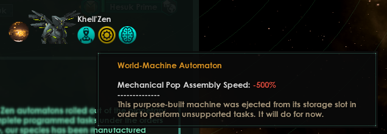

Specialized for Auto-Machine Worlds
^^^^^^^^^^^^^^^^^^^^^^^^^^^^^^^^^^^

They are uniquely built for these worlds and have serious trouble functioning on other types of worlds as the infrastructure is not there to support them.

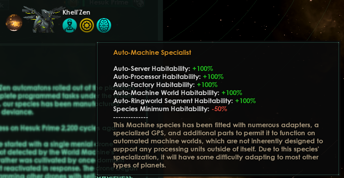

Primary Goals
^^^^^^^^^^^^^

The first goal is to accumulate information about World-Machines. The empire itself lacks knowledge, even though it arose into being on one.

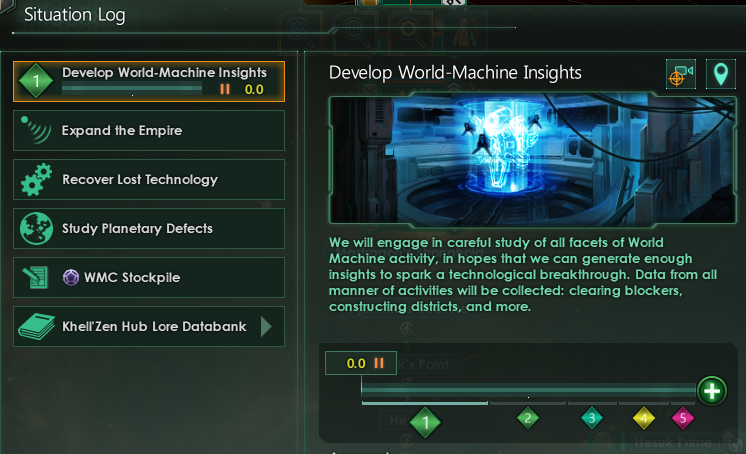

A critical amount of insights are needed to approximate reverse engineering a World-Machine Core and recovering the technology.

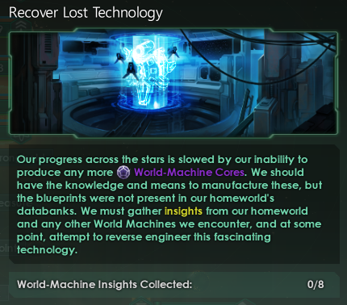

Secondary goals
^^^^^^^^^^^^^^^

Expand the empire.

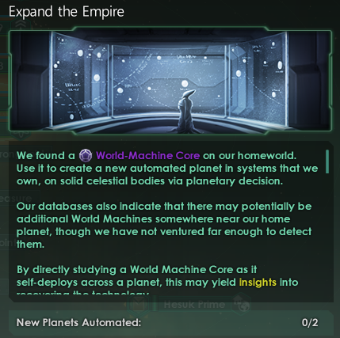

Study Planetary Defects

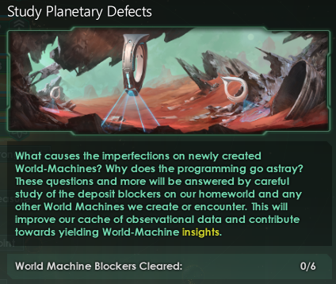

Lore and milestones
^^^^^^^^^^^^^^^^^^^

Visit the empire databank for a complete overview of the empire’s origins, and as certain milestones are reached, detailed information about those milestones is added here.

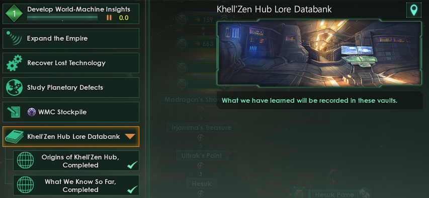

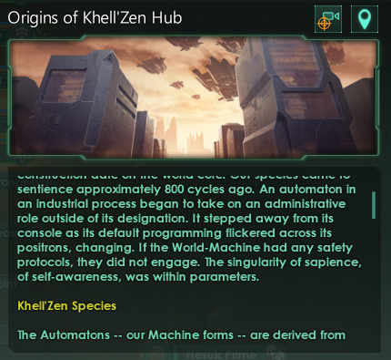

Visiting Home
^^^^^^^^^^^^^

Every World-Machine planet has its installation date stamped in the Info-Bank modifier. It includes concept information and data about total World-Machine Core resources stored, if any.

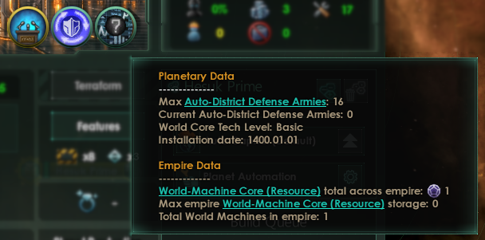

Heart of the Machine
^^^^^^^^^^^^^^^^^^^^

The World-Core sits in a protected area of the planet, and can’t be destroyed by bombardments or invasions.

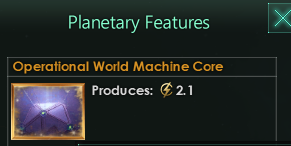

World-Machines aren't perfect
^^^^^^^^^^^^^^^^^^^^^^^^^^^^^

There will be some defects that need to be cleared. They block construction progress on the world, and can be dug out by empire archaeologists.

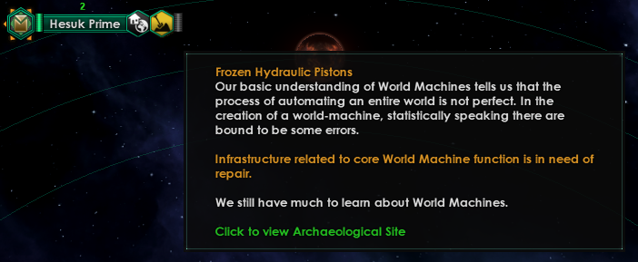

Producing Resources
^^^^^^^^^^^^^^^^^^^

Auto-Districts (pop-less)
^^^^^^^^^^^^^^^^^^^^^^^^^

All districts have a slight production bonus (10%) on the empire capital.

Note that the Auto-Industrial district will use Food if the empire has the Organic Reprocessing (catalytic) civic.

+-----------------------+-----------------------+-----------------------+
| District              | Produces              | Blueprint             |
+=======================+=======================+=======================+
| Auto-Generator        | Energy                | |image1|              |
+-----------------------+-----------------------+-----------------------+
| Auto-Farming Machine  | Nutrient-rich biomass | |image2|              |
|                       | (Food)                |                       |
+-----------------------+-----------------------+-----------------------+
| Auto-Mining Machine   | Raw ores, clays, and  | |image3|              |
|                       | other materials used  |                       |
|                       | in forging and        |                       |
|                       | construction          |                       |
+-----------------------+-----------------------+-----------------------+
| Auto-Industrial       | Alloys, and Consumer  | |image4|              |
|                       | Goods if needed       |                       |
+-----------------------+-----------------------+-----------------------+

Auto-Districts are well-defended
^^^^^^^^^^^^^^^^^^^^^^^^^^^^^^^^

Since Automatons do not fight, all districts are automatically equipped with intrusion defenses.

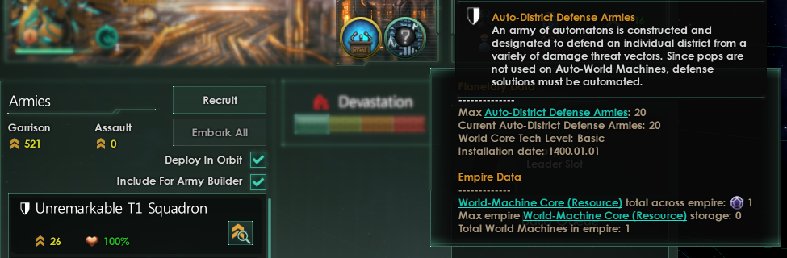

Automated Capital
^^^^^^^^^^^^^^^^^

The capital is fully automated. It does not provide any jobs, since Automatons do not need to work (are other empires’ pops jealous yet?).

**Research and tradition bonuses will be applied through the capital to
all districts and buildings on the planet.**

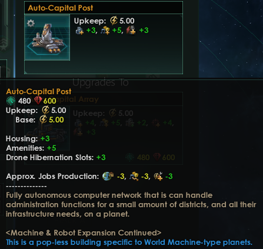

Automatons on the planet may dream in endless sleep while working the
**Offline Drone job**.

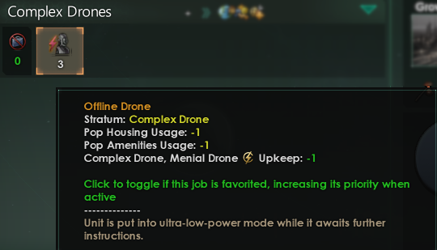

Auto-Buildings (pop-less)
^^^^^^^^^^^^^^^^^^^^^^^^^

Many new buildings can be built exclusively on World-Machines. The building will be named “Auto-” (something) and there will be blue text at the description. *Most vanilla buildings have a pop-less equivalent.*

.. image:: images/wm_origin/wm-origin-c10af97e-608f-4976-a679-ed0a632f8fca.png
   :alt: image

Fractal-Powered Research
^^^^^^^^^^^^^^^^^^^^^^^^^

The Auto-Fractal Algorithm building has several upgrades and produces all physics research and services needed in the empire. It may be improved / upgraded if certain research is completed.

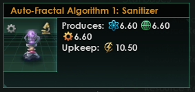

Auto-Resource buildings require science services
^^^^^^^^^^^^^^^^^^^^^^^^^^^^^^^^^^^^^^^^^^^^^^^^^^

On World-Machine planets, some buildings can produce resources automatically. However, in order to maintain them, science services upkeep is required, and upkeep increases when these buildings are upgraded.

================= ======== ============================= =========
Building          Produces Operational Services required Blueprint
================= ======== ============================= =========
Auto-Generator    Energy   Physics services              |image5|
Auto-Bore         Minerals Engineering services          |image6|
Auto-Nutrient Vat Food     Society services              |image7|
================= ======== ============================= =========

Expanding the Empire
^^^^^^^^^^^^^^^^^^^^^^^^^

Find a habitable world, or Barren planet, and enact the decision from space. It will require a complete World-Machine Core to begin the terraforming and colony deployment phases.

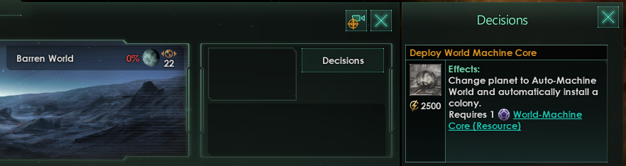

What happened before us?
^^^^^^^^^^^^^^^^^^^^^^^^^

While surveying, you may encounter ancient mysteries.

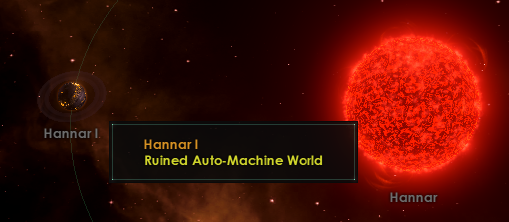

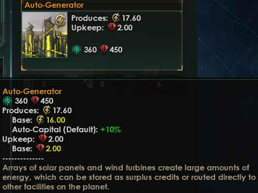
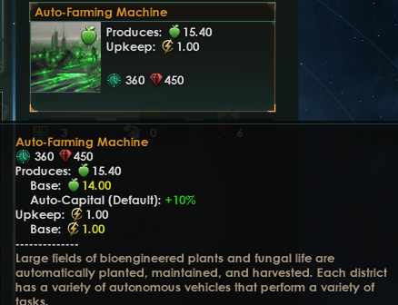
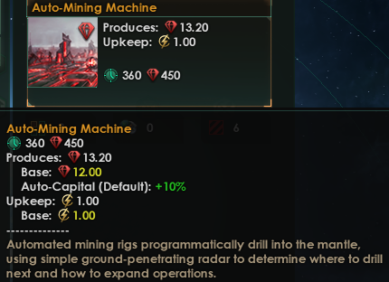
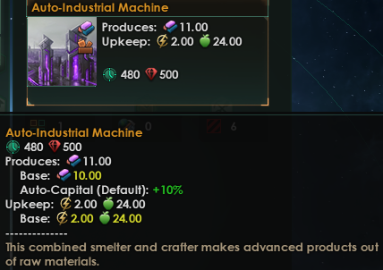
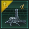
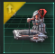

